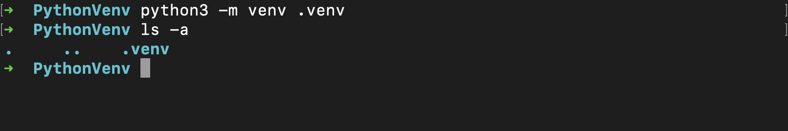

To create a virtual environment (venv) in Python, you can use the built-in venv module, which is available in Python 3.3 and later. It is used for creating isolated environments to manage project-specific dependencies.
(This is a MacOS specific guide)

# Creating a Virtual Environment

1. Open a terminal or command prompt.
2. Choose a directory where you want to create your virtual environment. 

```plaintext
cd Users/username/Desktop
```


3. Create the virtual environment by running the following command:

```plaintext
python3 -m venv venv_name
```
```bash
python3 -m venv .venv
```



4. Activate the virtual environment by running the following command:

```plaintext
source venv_name/bin/activate
```
```bash
source .venv/bin/activate
```
5. You can now install dependencies using pip 

6. To deactivate the virtual environment, run the following command:

```plaintext
deactive 
```


<br>


<br>

# Advantages of using venv:

- **Isolation:** One of the primary benefits of venv is that it isolates your project's dependencies from the global Python installation and other projects. This isolation helps prevent conflicts and ensures that your project can run in its own, controlled environment.

- **Version Compatibility:** You can create virtual environments with specific Python versions. This allows you to develop and test your project with a particular Python version, ensuring compatibility.

- **Dependency Management:** You can easily install, upgrade, or remove packages within a virtual environment using pip. This makes it straightforward to manage your project's dependencies without affecting other projects.

- **Cleaner Development:** Virtual environments promote a clean development environment. You can experiment with different packages and libraries without worrying about affecting other projects or your system-wide Python setup.

In summary, venv is a valuable tool for Python development, especially for projects using Python 3.3 and later. It offers a straightforward way to create isolated environments for managing dependencies and provides a clean and controlled development experience. 

<br>
<br>
<br>
<br>
