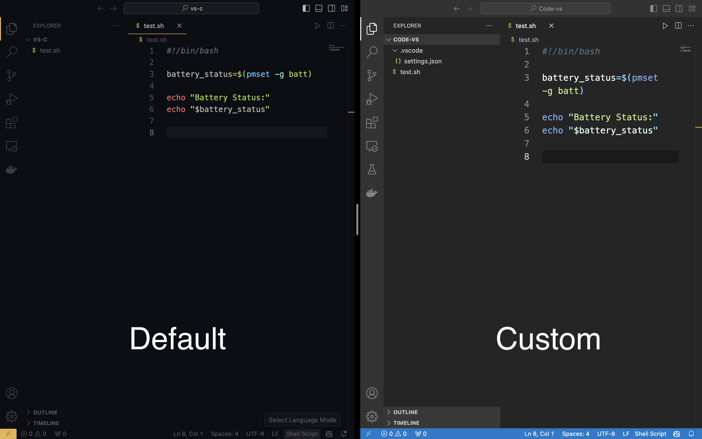

VS Code can be customized to have different settings and setup for every project, meaning for every project you can have a different custom vscode environment different or similar from the default vscode settings.


whenever you open anything in vscode, some settings apply by default like the font size, theme etc. and it remains constant for every project but if you want a different custom environment for some project it can be done by configuring a .vscode folder iniside which we you can have your json config files that states everything custom we want for this particular project and vs code will open your folder with these applied settings everytime you open it.

### Steps 

1. Create a .vscode folder in the root of your project directory 
2. crete a josn file named settings.json 
3. Now configure your custom settings sin this json file. here's a basic exmaple (for a more detailed overview visit the official documentation)

```json
{

    "editor.fontSize": 18,
    "editor.wordWrap": "on",

    "files.autoSave": "onWindowChange",   //(onFocusChange)
    "files.exclude" : {
        "**/.git": true,
        "**/.DS_Store": false
    },
    "workbench.colorTheme": "Sublime Material Theme - Dark", 

}
```
**editor.fontSize** - Font Size(TextSize) of the project 

**editor.wordWrap** - enable or disable word wrap (on/off)

**files.autoSave** - automatically save the file upon changing window or changing focus (onWindowChange/onFocusChange)

onWindowChange - saves the file automatically if you switch windows (when the active window change)

onFocusChange - saves the file automatically on changing focus like interacting with some other app or file in the same/different editor

**files.exclude** - exclude these files in the explorer.(these files may exist in the project but the explorer pane in vscode will not show these)

**workbench.colorTheme** - Theme for you editor. choose your favourite one or choose one from below


4. save this file and from now on whenever you open this project it will open with your custom settings whereas if you open any other project, it will open with the default settings only.





### My Most Favourite themes 

1. github vscode theme -

https://marketplace.visualstudio.com/items?itemName=GitHub.github-vscode-theme

```json
"workbench.colorTheme": "GitHub Dark Default" 

"workbench.colorTheme": "GitHub Dark Dimmed"

"workbench.colorTheme": "GitHub Light"
```

2. Ayu Theme -

https://marketplace.visualstudio.com/items?itemName=teabyii.ayu

```json
"workbench.colorTheme": "Ayu Dark" 
"workbench.colorTheme": "Ayu Mirage Bordered"
"workbench.colorTheme": "Ayu Light Bordered"
```

3. Sublime material theme -

https://marketplace.visualstudio.com/items?itemName=jprestidge.theme-material-theme

```json
"workbench.colorTheme": "Sublime Material Theme - Dark"
```

<br>
<br>
<br>
<br>